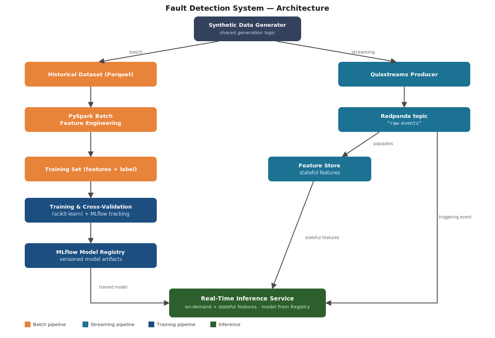

# Fault Detection System — MLOps Pipeline

An end-to-end, educational MLOps project that simulates fault detection on industrial machines. It generates synthetic sensor data, processes it in both batch and streaming modes, trains a classification model, and serves real-time predictions.

This project was built as a final assignment for an MLOps training course. It is a work in progress: some components are fully implemented, others are still being built (see [Status](#status)).

## Overview

The system simulates a fleet of industrial machines emitting sensor readings (e.g. temperature, plus additional numeric and categorical fields). Each machine cycles through a lifecycle — normal operation, a degrading phase, then a short run of consecutive fault readings — before returning to normal. This produces realistic, imbalanced fault data with a deliberately low proportion of positive (fault) labels.

The project is organized around four phases:

1. **Synthetic data generation & batch processing** — a shared data-generation module produces sensor readings; a historical batch of this data is processed with **PySpark** to build the training set (window aggregates and engineered features).
2. **Model training & cross-validation** — a classification model is trained on the engineered features using **scikit-learn**, with experiments tracked and models versioned through **MLflow**.
3. **Real-time data streaming** — the same data-generation logic streams synthetic readings into **Redpanda** (a Kafka-compatible broker) via **Quixstreams**.
4. **Real-time inference service** — a service consumes the live event stream, combines on-demand and stateful features, loads the trained model from the MLflow Model Registry, and produces a fault prediction per event.

## Architecture



A shared synthetic data generator feeds two parallel paths:

- **Batch path**: a historical dataset is processed with PySpark to engineer features (e.g. windowed statistics) and build the labeled training set used for model training and cross-validation. Trained models are tracked and versioned in the MLflow Model Registry.
- **Streaming path**: a Quixstreams producer publishes synthetic events to a Redpanda topic (`raw-events`). This topic is consumed by two components: a **Feature Store**, which maintains stateful/aggregated features, and the **Real-Time Inference Service**, which reacts to each incoming event, combines it with the stateful features from the Feature Store, loads the current model from the Model Registry, and returns a prediction.

## Tech Stack

- **Language & tooling**: Python 3.12, [uv](https://docs.astral.sh/uv/) for dependency management
- **Streaming**: [Quixstreams](https://quix.io/), [Redpanda](https://redpanda.com/) (Kafka-compatible broker)
- **Batch processing**: PySpark
- **Machine learning**: scikit-learn, MLflow (experiment tracking & model registry)
- **Infrastructure**: Docker, Docker Compose

## Setup & Usage

**Prerequisites**: Docker, Docker Compose, and [uv](https://docs.astral.sh/uv/) installed locally.

1. Copy the environment template and adjust if needed:
   ```bash
   cp .env.example .env
   ```
2. Install Python dependencies:
   ```bash
   uv sync
   ```
3. Start the infrastructure and streaming services:
   ```bash
   docker-compose up
   ```
   This starts Redpanda, Redpanda Console (available at `http://localhost:8080`), the synthetic data simulator, and the (prototype) alerts service.
4. To run a service locally instead of in Docker:
   ```bash
   uv run simulator.py
   uv run alerts-server.py
   ```

## Status

**Implemented**
- Synthetic data simulator streaming readings to a Redpanda topic via Quixstreams (`simulator.py`)
- Prototype real-time stream processing with tumbling-window aggregation (`alerts-server.py`)
- Docker Compose setup for Redpanda + Redpanda Console

**Planned**
- Shared data-generation module with a realistic fault lifecycle (normal → degrading → fault → normal), reused by both the batch and streaming paths
- PySpark batch feature-engineering pipeline and training set construction
- Model training and cross-validation with scikit-learn
- Experiment tracking and model versioning with MLflow
- Feature Store for stateful features
- Real-time inference service (replacing the current alert prototype)
